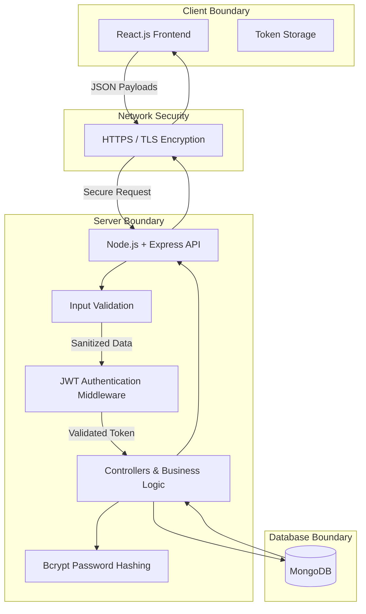

# HustleHub+ API

## System Overview & Intended Users
HustleHub+ is a secure freelance marketplace platform designed to connect service providers with clients. The system relies on a secure backend API that processes sensitive transactional and credential data. 
The intended users of this system include:
*   **Freelancers:** Users who advertise their services, manage gigs, and track their income.
*   **Clients:** Users who browse available services and book gigs.
*   **Administrators:** Users responsible for platform oversight (to be implemented in later phases).

## System Architecture

## Architecture Breakdown
The HustleHub+ backend is built on a MERN stack foundation, utilizing Node.js and Express to deliver a secure API. The architecture is divided into strict boundaries to enforce a separation of concerns:
*   **Client Boundary:** The React frontend handles the user interface and securely stores authentication tokens.
*   **Network Security:** All transit data is encrypted using HTTPS and a local SSL certificate to prevent data interception.
*   **Server Boundary:** The Express API acts as the central gatekeeper. It processes incoming requests through sequential middleware (validation and authentication) before passing them to the business logic controllers.
*   **Database Boundary:** MongoDB serves as the data persistence layer, completely isolated from direct client access to protect sensitive user and financial data.

## Security Implementation & Rationale
Security is treated as a primary architectural concern rather than an afterthought. The following controls have been implemented:
*   **Token-Based Authentication (JWT):** Authentication and session management are driven by JSON Web Tokens (JWT) to ensure stateless, secure interactions. Upon successful registration or login, the API generates a JWT containing the user's identification. The JWT Authentication Middleware intercepts subsequent requests and verifies the token's cryptographic signature; if invalid, the API rejects it with a safe 401 Unauthorized response.
*   **Input Validation:** To mitigate injection attacks and ensure data integrity, strict input validation is enforced at the API's edge. Malicious or missing inputs are immediately rejected. Error responses are highly controlled to ensure they are user-friendly while strictly preventing the exposure of internal system details like stack traces or file paths.
*   **Password Hashing (Bcrypt):** Plain-text passwords are never retained under any circumstances. Bcrypt is used to hash passwords before storage, ensuring that even if the database is compromised, user credentials remain mathematically irreversible.
*   **HTTPS Execution:** Enforcing TLS encryption ensures that highly sensitive data—particularly login credentials and active JWTs—cannot be compromised via man-in-the-middle (MITM) attacks over the network.

## Setup & Run Instructions

To run this secure API locally, you will need Node.js installed. 

1. **Install Dependencies:** Open your terminal in the `api` folder and run:
   `npm install`
2. **Generate Security Certificates:** Create a `certs` folder inside the `api` directory and run OpenSSL to generate your self-signed certificate:
   `openssl req -nodes -new -x509 -keyout server.key -out server.cert -days 365`
3. **Environment Variables:** Ensure you have a `.env` file in the root of the `api` directory containing your local port and any necessary secret keys.
4. **Start the Server:** Run the following command to start the API securely over HTTPS:
   `npm run dev`
